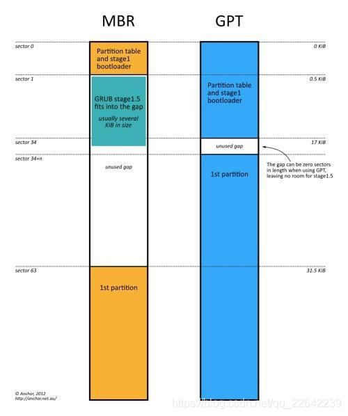

- 系统启动过程
    - BIOS/UEFI --> Bootloader --> kernel

# BIOS/UEFI 启动阶段
- 该阶段有两种引导方式：传统的 BIOS 模式（功能有限）以及UEFI 模式（功能丰富），核心功能大致是一些硬件启动前的检测，提供交互式界面来配置启动参数，加载 bootloader 到内存，并且将控制权交给 bootloader。
- 启动方式
    - BIOS 是 Basic Input Output System 的缩写。它的全称应该是ROM－BIOS，意思是只读存储器基本输入输出系统。其实，它是一组固化到计算机内主板上一个ROM芯片上的程序，它保存着计算机最重要的基本输入输出的程序、系统设置信息、开机上电自检程序和系统启动自举程序。
    - UEFI 是一种更快捷快速的电脑启动配置，它的全称是“统一可扩展固件接口”(Unified Extensible Firmware Interface), 可以说是 BIOS 的继承者。它能够识别文件系统，直接读取 bootloader 文件，而不用像 BIOS 一样，只能从启动盘第一个扇区读取 bootloader。
- 主要功能
    - POST (Power On Self Test)
    - 加载 bootloader，并把控制权转交给 bootloader

# 硬盘分区 MBR GPT
- 主引导记录(MBR, Master Boot Record)是硬盘的第一个扇区，即C/H/S地址的0柱面0磁头1扇区，也叫做MBR扇区。是IBM公司早年间提出的。它是存在于磁盘驱动器开始部分的一个特殊的启动扇区。
    - 这个扇区包含了已安装的操作系统系统信息，并用一小段代码来启动系统。如果你安装了Windows，其启动信息就放在这一段代码中——如果MBR的信息损坏或误删就不能正常启动Windows，这时候你就需要找一个引导修复软件工具来修复它就可以了。
    - Linux系统中MBR通常会是GRUB加载器。我们经常能看到一台电脑启动时，会先第一个看到的画面就是主板启动的画面，电脑会先启动主板自带的BIOS系统，然后bios加载MBR，MBR再启动Windows，这就是电脑开机时bios到mbr到系统的启动过程。
- GPT的意思是GUID Partition Table，即“全局唯一标识磁盘分区表”。他是另外一种更加先进新颖的磁盘组织方式，一种使用UEFI启动的磁盘组织方式。
    - 最开始是为了更好的兼容性，后来因为其更大的支持内存（mbr分区最多支持2T的磁盘），更多的兼容而被广泛使用，特别是苹果的MAC系统全部使用gpt分区。
    - gtp不再有分区的概念，所有CDEF盘都在一段信息中存储。可以简单的理解为更先进但是使用不够广泛的技术
- MBR GPT 区别
    - 分区：mbr最多支持四个主分区，gpt没有限制。如果你想跑多系统，mbr最多4个而gpt没有限制。
    - 系统：win7只能用mbr分区（也可以但是很麻烦，不建议），从Win8开始微软建议你使用gpt。
    - 其它：gpt是由uefi启动的，而uefi是后来才提出的概念，兼容性和稳定性不如bios+mbr。
    - 因为兼容问题，gpt其实在引导的最开始部分也有一段mbr引导，也叫做“保护引导”，为了防止设备不支持uefi 区别内存支持：mbr最多支持2T，而gpt理论上是无限制的。
    - 
    - 具体区别参考：[Linux 启动流程](https://blog.csdn.net/anhui_chen/article/details/106988113)

- 较老的系统是通过 BIOS + MBR分区实现的系统引导，现在的系统(Windows, linux, mac...)基本都采用 UEFI + GPT分区实现的系统引导.

# UEFI + GPT
- 引导方式如下（centOS系统为例）：
    - x86_64: uefi ==> shimx64.efi ==> grubx64.efi ==> /boot/efi/EFI/centos/grub.cfg ==> vmlinuz & initramfs
    - aarch64: uefi ==> shimaa64.efi ==> grubaa64.efi ==> /boot/efi/EFI/centos/grub.cfg ==> vmlinuz & initramfs
- x86 架构系统中，shimx64.efi 和 grubx64.efi 是 UEFI 启动方式下的 bootloader，他们以文件的形式存在于磁盘的 /boot/efi/EFI/centos 目录下，UEFI 可以直接识别文件系统，并获取 shimx64.efi 加载到内存运行，然后 shimx64.efi 获取 grubx64.efi，grubx64.efi 则通过 grub.cfg 寻找 vmlinuz 和 initfamfs，并将其加载到内存中。arm 架构系统过程类似。