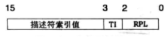

- 实模式和保护模式都是CPU的工作模式，而CPU的工作模式是指CPU的寻址方式、寄存器大小等用来反应CPU在该环境下如何工作的概念。

# 实模式
- 实模式出现于早期8088CPU时期。当时由于CPU的性能有限，一共只有20位地址线（所以地址空间只有1MB），以及8个16位的通用寄存器，以及4个16位的段寄存器。
- 当某个指令想要访问某个内存地址时，它通常需要用下面的这种格式来表示：
    - (段基址：段偏移量)
    - 段基址: 它的值是由`段寄存器`提供的(一般来说，段寄存器有6种，分别为cs，ds，ss，es，fs，gs)
    - 段内偏移量: 代表你要访问的这个内存地址距离这个段基址的偏移。它的值就是由`通用寄存器`来提供的.
    - 物理地址 = 段基址<<4 + 段内偏移

# 保护模式
- CPU的地址线的个数也从原来的20根变为现在的32根，寄存器的位数也变为32位，段寄存器依然是16位，但是这些段寄存器存放的却不再是段基址了。
- Segment:

- 关于内存段的限制信息放在一个叫做`全局描述符表(GDT)`的结构里.
    - 全局描述符表位于内存中，需要用专门的寄存器指向它后， CPU 才知道它在哪里。这个专门的寄存器便是`GDTR`(一个48位的寄存器),专门用来存储 GDT 的内存地址及大小。
    - 全局描述符表中含有一个个表项，每一个表项称为`段描述符`
    - `段寄存器`在保护模式下`存放`的便是相当于一个数组`索引`的东西，通过这个索引，可以找到对应的表项
    - `段描述符`存放了段基址、段界限、内存段类型属性(比如是数据段还是代码段,注意一个段描述符只能用来定义一个内存段)等许多属性
        - 
        - 
        - `段界限`表示段边界的扩张最值，即最大扩展多少或最小扩展多少，用20位来表示，它的单位可以是字节，也可以是4KB，这是由G位决定的(G为1时表示单位为4KB)
        - 实际`段界限边界值`=(描述符中的段界限+1)*（段界限的单位大小(即字节或4KB))-1，如果偏移地址超过了段界限，CPU会抛出异常。
    - `段的选择子`: 段寄存器 CS、 DS、 ES、 FS、 GS、 SS，在实模式下时，段中存储的是段基地址，即内存段的起始地址。 而在保护模式下时，由于段基址已经存入了段描述符中，所以段寄存器中再存放段基址是没有意义的，在段寄 存器中存入的是一个叫作选择子的东西。
        - 
        - 选择子“基本上”是个索引值，虽然它还有其他内容，不过作为初学者暂时忽略也没太大关系。
        - 由于段寄存器是 16 位，所以选择子也是 16 位，在其低 2 位即第 0～1 位， 用来存储 `RPL`，即请求特权级(有兴趣的可以了解一下，不想了解的忽略即可，跟用户态和内核态相关的)，可以表示 0、 1、 2、 3 四种特权级。
        - 在选择子的第 2 位是 `TI` 位，即 Table Indicator，用来指示选择子是在 GDT 中，还是 LDT 中索引描述符。 TI 为 0 表示在 GDT 中索引描述符， TI 为 1 表示在 LDT 中索引描述符。
        - 选择子的高 13 位，即第 3～15 位是 描述符的索引值，用此值在 GDT 中索引描述符。
- 此外， 扩充的存储器分段管理机制和可选的存储器分页管理机制，不仅为存储器共享和保护提供了硬件支持，而且为实现虚拟存储器提供了硬件支持; 支持多任务，能够快速地进行任务切换(switch)和保护任务环境(context); 4个特权级和完善的特权检查机制，既能实现资源共享又能保证代码和数据的安全和保密及任务的隔离; 支持虚拟8086方式，便于执行8086程序。