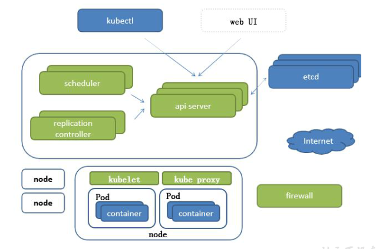
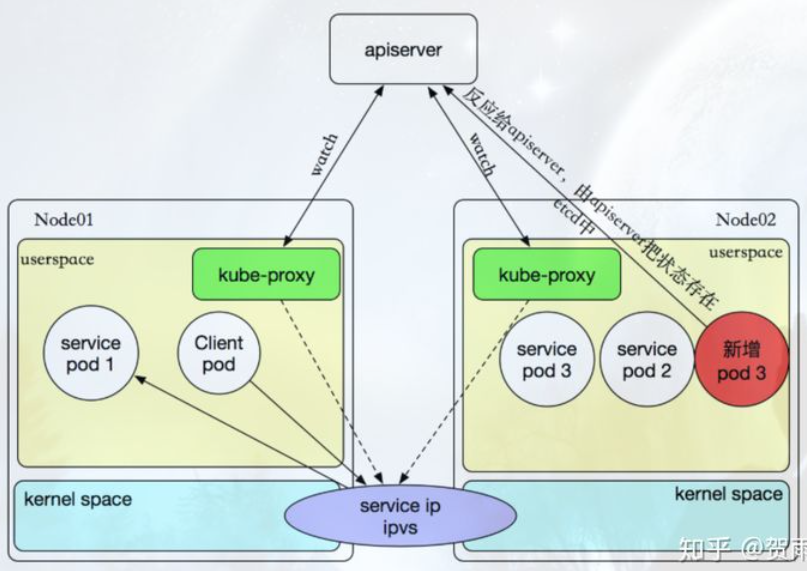
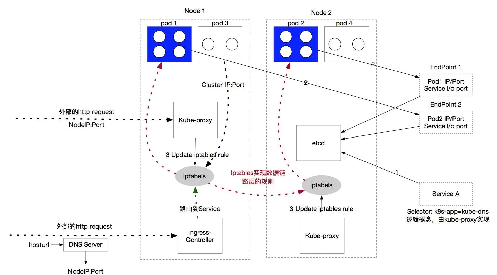
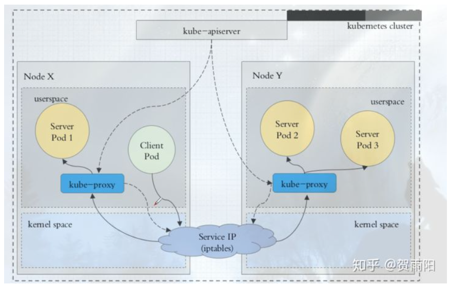
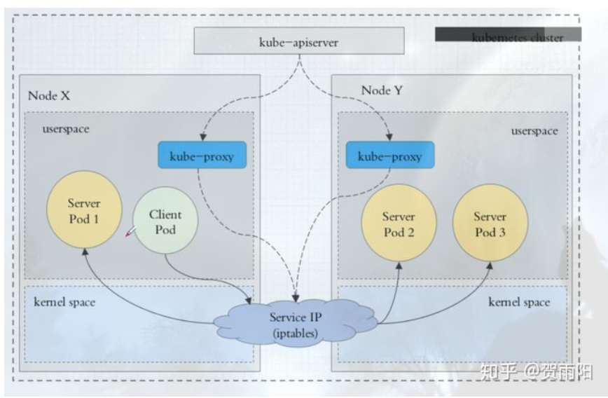
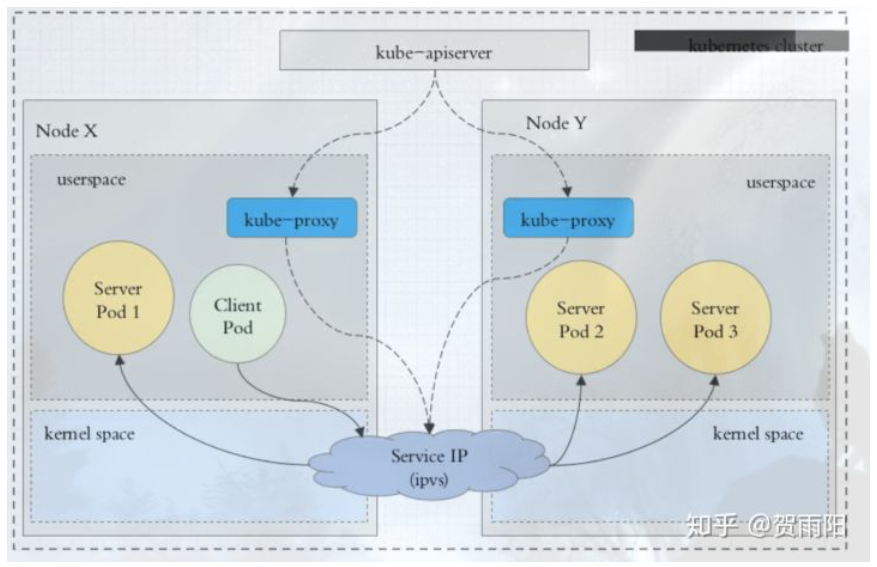
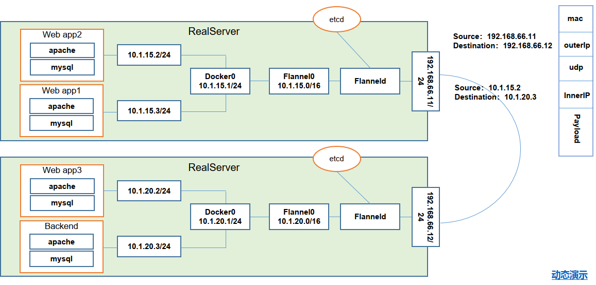

# Prepare
- 服务分类
	- 有状态服务：DBMS  
	- 无状态服务：LVS APACHE
- 高可用集群副本数据最好是 >= 3 奇数个
- 命令式编程：它侧重于如何实现程序，就像我们刚刚接触编程时那样，我们需要把程序的实现过程按照逻辑结果一步步写下来
- 声明式编程：它侧重于定义想要什么，然后告诉计算机/引擎，让他帮你去实现

# 基本概念
- structure: 
- APISERVER：所有服务访问统一入口
- CrontrollerManager：维持副本期望数目
- Scheduler：：负责介绍任务，选择合适的节点进行分配任务
- ETCD：键值对数据库  储存K8S集群所有重要信息（持久化）
- Kubelet：直接跟容器引擎交互实现容器的生命周期管理
- Kube-proxy：负责写入规则至 IPTABLES、IPVS 实现服务映射访问的
- COREDNS：可以为集群中的SVC创建一个域名IP的对应关系解析
- DASHBOARD：给 K8S 集群提供一个 B/S 结构访问体系
- INGRESS CONTROLLER：官方只能实现四层代理，INGRESS 可以实现七层代理
- FEDERATION：提供一个可以跨集群中心多K8S统一管理功能
- PROMETHEUS：提供K8S集群的监控能力
- ELK：提供 K8S 集群日志统一分析介入平台

# POD
- 分类：
    - 自主式 Pod: 也就是由yaml文件来创建的pod，也就是pod自己去控制自己，防止pod被控制器杀死.
    - 控制器管理的 Pod
- Pod启动时自动创建pause容器，Pod中不同容器端口不能公用，不同容器共享pause网络栈以及Pod挂载的外部存储
## Pod控制器类型
- ReplicationController & ReplicaSet & Deployment --> HPA(HorizontalPodAutoScale)
    - ReplicationController(RC) 用来确保容器应用的副本数始终保持在用户定义的副本数，既如果有容器异常退出，会自动创建新的Pod来代替；而如果异常多出来的容器也会自动回收。新版中建议ReplicaSet来代替。
    - ReplicaSet(RS) 跟ReplicationController没有本质区别，ReplicaSet支持集合式的selector
    - 虽然ReplicaSet可以独立使用，但一般还是建议使用deployment来自动管理ReplicaSet，这样就无需担心跟其他机制的不兼容问题（ReplicaSet不支持Rolling-update，但Deployment支持）
    - Deployment为Pod和ReplicaSet提供一种声明式定义（declarative）方法，用来代替以前的ReplicationController来方便的管理应用。Deployment并不会创建Pod，Deployment创建RS，RS去创建Pod。典型场景包括：
        - 定义Deployment来创建Pod和ReplicaSet
        - 滚动升级和回滚应用
        - 扩容 缩容
        - 暂停和继续deployment
    - Horizontal Pod Autoscaling 仅适用于 Depolyment 和 ReplicaSet， V1版本中仅支持根据Pod的CPU利用率扩缩容，在v1 alpha版本中，支持根据内存和用户自定义的metric扩缩容
- StatefullSet
    - StatefullSet 为了解决有状态服务的问题（对应Deployment和ReplicaSets是为无状态服务而设计）。
    - 场景包括：
        - 稳定的持久化存储，既Pod重新调用后还是能访问到相同的持久化数据，基于PVC实现
        - 稳定的网络标志，既Pod重新调度后其PodName和HostName不变，基于Headless Service（既没有Cluster IP的service）来实现
        - 有序部署，有序扩展，既Pod是有顺序的，在部署或者扩展的时候依据定义的顺序依次进行（既从0到N-1,在下一个Pod运行之前的Pod必须都是Running和Ready状态），基于Init containers来实现
        - 有序收缩，有序删除（既从N-1到0）
- DaemonSet
    - DaemonSet确保全部（或者一些）Node上运行一个Pod的副本。当有Node加入集群时，也会为他们新增一个Pod，当有Node从集群移除时，这些Pod也会被回收。删除DaemonSet将会删除它创建的所有的Pod
    - 场景包括：
        - 运行集权存储 daemon，例如在每个Node上运行gulstered,ceph.
        - 在每个Node上运行日志收集daemon，例如fluentd, logstash。
        - 在每个Node上运行监控daemon，例如Prometheus Node Exporter
- Job, Cornjob
    - Job负责批处理任务，既仅执行一次的任务，它保证批处理任务的一个或多个Pod成功结束
    - Corn Job 管理基于时间的Job， 既：
        - 在给定时间只运行一次
        - 周期性地在给定时间点运行
## 服务发现
- structure: 
- 为什么会有service？
    - 如果Pod是一组应用容器的集合，那Service是不是就没有意义了，他的意义在于当应用服务需要做负载、需要做全生命周期的跟踪和管理时就体现出来了，所以Service是一个抽象的概念，它定义了Pod逻辑集合和访问这些Pod的策略。
    - 一个非常常见的场景，当一个Pod因为某种原因停止运行了，kubelet根据deployment的需求重新启动一个新的Pod来提供之前Pod的功能，但是flannel会给这个新的Pod分配一个新的IP，这会带来很大的Effort，应用服务的很多配置项都需要调整，如果有了Service呢，这就不是问题，看下Service的运行原理。
    - 
- KubeProxy的实现模式
    - 这张图解释了Service的运行机制，当Service A创建的时候，Service Controller和EndPoints Controller就会被触发更新一些资源，例如基于Service中配置的Pod的selector给每一个Pod创建一个EndPoint资源并存入etcd，kube-proxy还会更新iptables的chain规则生成基于Service的Cluster IP链路到对应Pod的链路规则，接下来集群内的一个pod想访问某个服务，直接cluster ip:port即可基于iptables的链路将请求发送到对应的Pod，这一层有两种挑选pod的算法，轮询(Round Robin)和亲和度匹配(Session Affinity)。当然，除了这种iptabels的模式，还有一种比较原始的方式就是用户态的转发，Kube-Proxy 会为每个 Service 随机监听一个端口 (Proxy Port)，并增加一条 IPtables 规则。从客户端到 ClusterIP:Port 的报文都会被重定向到 Proxy Port，Kube-Proxy 收到报文后，通过 Round Robin (轮询) 或者 Session Affinity（会话亲和力，即同一 Client IP 都走同一链路给同一 Pod 服务）分发给对应的 Pod。
    - 当然，新版本的k8s开始基于ipvs来替换iptables了，但是形式和iptables是类似的。
- 在 Kubernetes 集群中，每个 Node 运行一个 kube-proxy 进程。kube-proxy 负责为 Service 实现了一种 VIP（虚拟 IP）的形式。
- kube-proxy 这个组件始终监视着apiserver中有关service的变动信息，获取任何一个与service资源相关的变动状态，通过watch监视，一旦有service资源相关的变动和创建，kube-proxy都要转换为当前节点上的能够实现资源调度规则（例如：iptables、ipvs）
- usersapce 模式：
    - 
- iptables 模式：
    - 
- ipvs 模式:
    - 
    - IPVS是 LVS 项目的一部分，是一款运行在 Linux Kernel 当中的 4 层负载均衡器，性能异常优秀。使用调优后的内核，可以轻松处理每秒 10 万次以上的转发请求。目前在中大型互联网项目中，IPVS 被广泛的用于承接网站入口处的流量。
## Pod 协同

# 网络通讯方式
- kubernetes 网络模型假定所有Pod都在一个可以直接连同的扁平的网络空间中，这在GCE(google compute engine)里是现成的网络模型，K8s假定这个网络已经存在。私有云中搭建K8S集群，就不能假定这个网络存在，需要自己实现，将不同节点上的docker之间互相访问先打通，再运行K8s.
- 通讯：
    - 同一个Pod内多个容器之间：lo, 同一个Pod共享一个网络命名空间，共享一个Linux协议栈
    - 各Pod之间通讯：overlay network
        - 不在同一台主机，Pod地址与docker0在同一个网段的，但docker0网段与宿主机网卡是完全不同的IP网段，并且不同Node之间通讯只能通过宿主机的物理网卡进行，将Pod的IP与所在Node的IP关联起来，通过这个关联让Pod可以互相访问
        - 在同一台主机，由docker0网桥直接转发请求到Pod2,不需要经过Flannel
    - Pod于service之间通讯： 目前基于性能考虑，全部为iptables(LVS)维护和转发。
    - Pod到外网：Pod想外网发送请求，查找路由表，转发数据到宿主机网卡，宿主机网卡完成路由选择后，iptables执行masquerade，把源IP更改为宿主机网卡IP，然后向外网服务器发送请求。
    - 外网访问Pod service: 通过kube-proxy
- Flannel 是CoreOS团队针对K8s设计的网络规划服务。让集群中不同节点主机创建的Docker容器具有全集唯一的VIP，这些IP之间建立一个overlay network，通过这个网络，将数据包原封不动地传递到目标容器内。
- 
- ETCD with Flannel:
    - 存储管理Flannel可分配IP地址段资源
    - 监控ETCD中每个Pod的实际地址，并在内存中建立维护Pod节点路由表
