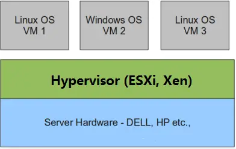

# 虚拟化
- 虚拟化是云计算的基础。简单的说，虚拟化使得在一台物理的服务器上可以跑多台虚拟机，虚拟机共享物理机的 CPU、内存、IO 硬件资源，但逻辑上虚拟机之间是相互隔离的。
- 物理机我们一般称为宿主机（Host），宿主机上面的虚拟机称为客户机（Guest）。物理机我们一般称为宿主机（Host），宿主机上面的虚拟机称为客户机（Guest）。
## Hypervisor
- 这个主要是通过一个叫做 Hypervisor 的程序实现的。根据 Hypervisor 的实现方式和所处的位置，虚拟化又分为两种：1型虚拟化和2型虚拟化。
    - 1型虚拟化
        - 
        - Hypervisor 直接安装在物理机上，多个虚拟机在 Hypervisor 上运行。Hypervisor 实现方式一般是一个特殊定制的 Linux 系统。Xen 和 VMWare 的 ESXi 都属于这个类型。
    - 2型虚拟化
        - 
        - 物理机上首先安装常规的操作系统，比如 Redhat、Ubuntu 和 Windows。Hypervisor 作为 OS 上的一个程序模块运行，并对管理虚拟机进行管理。KVM、VirtualBox 和 VMWare Workstation 都属于这个类型。
    - 理论上讲：
        - 1型虚拟化一般对硬件虚拟化功能进行了特别优化，性能上比2型要高；
        - 2型虚拟化因为基于普通的操作系统，会比较灵活，比如支持虚拟机嵌套。嵌套意味着可以在KVM虚拟机中再运行KVM。
## KVM
- KVM 全称是 Kernel-Based Virtual Machine。也就是说 KVM 是基于 Linux 内核实现的。KVM有一个内核模块叫 kvm.ko，只用于管理虚拟 CPU 和内存。
- 那 IO 的虚拟化，比如存储和网络设备由谁实现呢？
    - 这个就交给 Linux 内核和 Qemu 来实现。说白了，作为一个 Hypervisor，KVM 本身只关注虚拟机调度和内存管理这两个方面。IO 外设的任务交给 Linux 内核和 Qemu。
