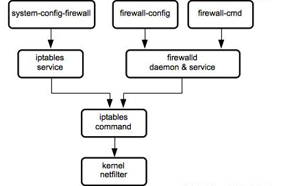

# introduce
- 在CentOS 7里有几种防火墙共存：firewalld、iptables、ebtables。
- 默认是使用firewalld来管理netfilter子系统，不过底层调用的命令仍然是iptables等。
- firewalld跟iptables比起来，不好的地方是每个服务都需要去设置才能放行，因为默认是拒绝。
- 而iptables里默认是每个服务是允许，需要拒绝的才去限制。
- 
## firewalld与iptables的关系
- firewalld跟iptables比起来至少有两大好处：
    - firewalld可以动态修改单条规则，而不需要像iptables那样，在修改了规则后必须得全部刷新才可以生效；
    - firewalld在使用上要比iptables人性化很多，即使不明白“五张表五条链”而且对TCP/IP协议也不理解也可以实现大部分功能。
    - note: firewalld自身并不具备防火墙的功能，而是和iptables一样需要通过内核的netfilter来实现，
- 也就是说firewalld和 iptables一样，他们的作用都是用于维护规则，而真正使用规则干活的是内核的netfilter，只不过firewalld和iptables的结构以及使用方法不一样罢了。

# 基本概念
- zone
    - 区域(zone)基本上是一组规则，它们决定了允许哪些流量，具体取决于你对计算机所连接的网络的信任程度。为网络接口分配了一个区域，以指示防火墙应允许的行为。
    - Firewalld 一般已经默认内置了 9 个区域(zone)，大部分情况下，这些已经足够使用，按从最不信任到最受信任的顺序为：
        - drop：最低信任级别。所有传入的连接都将被丢弃而不会回复，并且只能进行传出连接。
        - block：与上述类似，但不是简单地删除连接，而是使用 icmp-host-prohibitedor 和 icmp6-adm-prohibited 消息拒绝传入的请求。
        - public：表示不信任的公共网络。您不信任其他计算机，但可能会视情况允许选择的传入连接。默认情况下，此区域为激活状态。
        - external：如果你使用防火墙作为网关，则为外部网络。将其配置为 NAT 转发，以便你的内部网络保持私有但可访问。
        - internal：external 区域的另一侧，用于网关的内部。这些计算机值得信赖，并且可以使用一些其他服务。
        - dmz：用于 DMZ (DeMilitarized Zone) 中的计算机（将无法访问网络其余部分的隔离计算机），仅允许某些传入连接。
        - work：用于工作机。信任网络中的大多数计算机。可能还允许其他一些服务。
        - home：家庭环境。通常，这意味着您信任其他大多数计算机，并且将接受其他一些服务。
        - trusted：信任网络中的所有计算机。可用选项中最开放的，应谨慎使用。
    - firewalld默认提供了九个zone配置文件/usr/lib/firewalld/zones/：block.xml、dmz.xml、drop.xml、external.xml、 home.xml、internal.xml、public.xml、trusted.xml、work.xml
    - 默认情况下,在/etc/firewalld/zones下面只有一个public.xml。如果给另外一个zone做一些改动，并永久保存，那么会自动生成对应的配置文件.
    - `对于一个接收到的请求使用哪个zone，firewalld是通过三种方式判断的`：
        - `source，来源地址`
        - `Interface，接收请求的网卡`
        - `firewalld配置的默认区域（zone）`
        - 这三个方式的优先级按顺序依次降低，也就是说如果按照source可以找到就不会再按interface去找，如果前两个都找不到才会使用第三个默认区域。

# command
- `firewall-cmd --reload` 从新加载配置
- `firewall-cmd --state` 查看firewalld的运行状态
- `firewall-cmd --get-default-zone` 查看默认当前使用的区域
- `firewall-cmd --get-active-zones` 查看系统默认活动区域名称、来源地址和关联的网卡
- `firewall-cmd --get-zones` 查看所有可用区域
- 查看区域的所有设置
    - `firewall-cmd --zone=internal --list-all`   # 查看指定区域设置
    - `firewall-cmd --list-all`   # 查看默认区域设置
        - Target：目标
        - icmp-block-inversion：ICMP协议类型黑白名单开关（yes/no）
        - Interfaces：关联的网卡接口
        - sources：来源，可以是IP地址，也可以是mac地址
        - services：允许的服务
        - ports：允许的目标端口，即本地开放的端口
        - protocols：允许通过的协议
        - masquerade：是否允许伪装（yes/no），可改写来源IP地址及mac地址
        - forward-ports：允许转发的端口
        - source-ports：允许的来源端口
        - cmp-blocks：可添加ICMP类型，当icmp-block-inversion为no时，这些ICMP类型被拒绝；当icmp-block-inversion为yes时，这些ICMP类型被允许。
        - rich rules：富规则，即更细致、更详细的防火墙规则策略，它的优先级在所有的防火墙策略中也是最高的。
- `firewall-cmd --get-services` 查看所有预设的服务
    - 此时将会列出/usr/lib/firewalld/services/目录中所有的服务名称。
- `firewall-cmd --list-all-zones` 查看所有区域的设置
- `firewall-cmd --get-zone-of-interface=ens32` 查看指定网卡所在的区域
- `firewall-cmd --set-default-zone=drop` 把firewalld的当前默认区域设置为drop，此为永久设置
- 把ens32网卡关联的区域修改为drop:
    - `firewall-cmd --permanent --zone=drop --change-interface=ens32`   # 永久设置
    - `firewall-cmd --zone=drop --change-interface=ens32`   # 当前生效