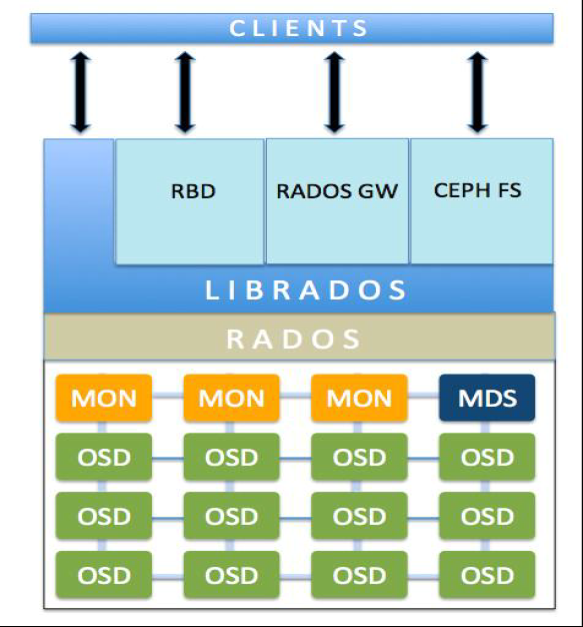
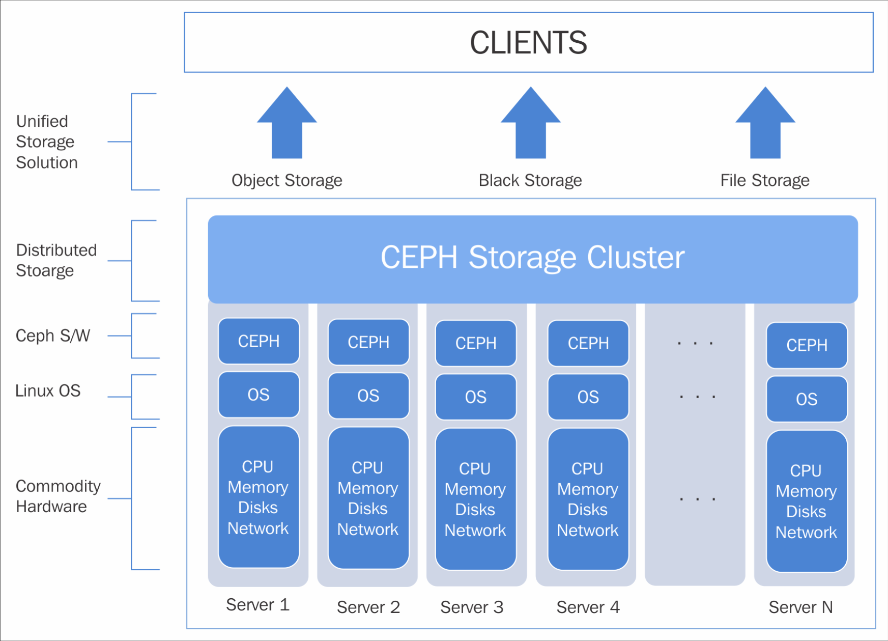

# 简介
- Ceph是一个统一的分布式存储系统，设计初衷是提供较好的性能、可靠性和可扩展性.
- 特点：
    - 高性能
    - 高可用
    - 高扩展
    - 特性丰富
- 功能：
    - `Object`(对象)：有原生的API，而且也兼容Swift和S3的API。
    - `Block`（块）：支持精简配置、快照、克隆。
    - `File`（文件系统）：Posix接口，支持快照。

## 组件
- Ceph Monitor(`MON`): 保存，同步OSD元数据 （可以是OSD中的一员充当Monitor）。CephCeph Ceph监视器通过保存集群状态的映射来跟踪整个健康状况。
    - Ceph Monitor (Ceph -mon)维护集群状态的map，包括Monitor map、manager map、OSD map、MDS map和CRUSH map。这些映射是Ceph守护进程相互协调所需要的关键集群状态。monitor还负责管理守护进程和客户机之间的身份验证。通常至少需要三个monitor以实现冗余和高可用性。
- `Ceph manager`: Ceph manager守护进程(Ceph-mgr)是在Kraken版本中引入的，它与monitor守护进程一起运行，为外部监视和管理系统提供额外的监视和接口。
    - Ceph管理器守护进程(Ceph -mgr)负责跟踪运行时指标和Ceph集群的当前状态，包括存储利用率、当前性能指标和系统负载。Ceph管理器守护进程还托管了基于python的模块来管理和公开Ceph集群信息，包括基于web的Ceph仪表板和REST API。高可用性通常需要至少两个管理器
- OSD: `OSD`全称Object Storage Device，也就是负责响应客户端请求返回具体数据的进程。一个Ceph集群一般都有很多个OSD.
    - Ceph OSD (object storage daemon，简称Ceph - OSD)负责存储数据、处理数据复制、恢复、再平衡，并通过心跳检查其他Ceph OSD进程，向Ceph监控器和管理器提供一些监控信息。冗余和高可用性通常需要至少3个Ceph osd。
    - 一旦应用程序向 CephCeph Ceph集群发出写操作，数据就以对象的形式存储在 OSDOSD 中。
    - 这是Ceph集群中存储实际用户数据的惟一组件，通常一个OSD守护进程绑定到集群中的一个物理磁盘。因此，通常来说Ceph集群中物理磁盘的总数与在每个上存储用户据OSD守护进程的总数相同。
- `MDS` ：MDS全称Ceph Metadata Server，是CephFS服务依赖的元数据服务. MDS跟踪文件层次结构，仅为Ceph FS文件系统存储元数据, 如果不需要CephFS可以不需要该组件。
    - Ceph元数据服务器(MDS, Ceph - MDS)代表Ceph文件系统存储元数据(即Ceph块设备和Ceph对象存储不使用MDS)。Ceph元数据服务器允许POSIX文件系统用户执行基本命令(如ls、find等)，而不会给Ceph存储集群带来巨大负担。
- `Object`：Ceph最底层的存储单元是Object对象，每个Object包含元数据和原始数据。
- `PG` ：　PG是一个逻辑概念，我们linux系统中可以直接看到对象，但是无法直接看到PG。它在数据寻址时类似于数据库中的索引：每个对象都会固定映射进一个PG中，所以当我们要寻找一个对象时，只需要先找到对象所属的PG，然后遍历这个PG就可以了，无需遍历所有对象。而且在数据迁移时，也是以PG作为基本单位进行迁移，ceph不会直接操作对象。
    - PG全称Placement Grouops，是一个逻辑的概念，一个PG包含多个OSD。引入PG这一层其实是为了更好的分配数据和定位数据。
- `RADOS` ：RADOS全称Reliable Autonomic Distributed Object Store，是Ceph集群的精华，用户实现数据分配、Failover等集群操作。
    - RADOS对象存储负责存储这些对象，而不管它们的数据类型如何。RADOS层确保数据始终保持一致。为此，它执行数据复制、故障检测和恢复，以及跨集群节点的数据迁移和再平衡。
- `Libradio` ：Librados是Rados提供库，因为RADOS是协议很难直接访问，因此上层的RBD、RGW和CephFS都是通过librados访问的，目前提供PHP、Ruby、Java、Python、C和C++支持。
- `CRUSH` ：CRUSH是Ceph使用的数据分布算法，类似一致性哈希，让数据分配到预期的地方。
- `RBD`（块存储）：RBD全称RADOS block device，是Ceph对外提供的块设备服务。
- `RGW`（对象存储）：RGW全称RADOS gateway，是Ceph对外提供的对象存储服务，接口与S3和Swift兼容
- `CephFS`（文件系统）：CephFS全称Ceph File System，是Ceph对外提供的文件系统服务。
- 
- 