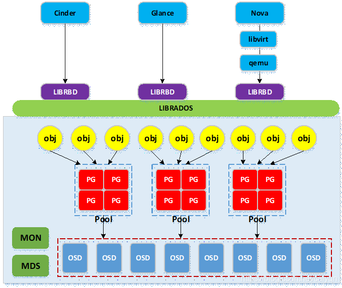

# Intro
- 数据存储类型
    - 临时性存储：主要由本地文件系统提供，并主要用于nova虚拟机的本地系统与临时数据盘，以及存储glance上传的系统镜像；
    - 永久性存储：主要由cinder提供的块存储与swift提供的对象存储构成，以cinder提供的块存储应用最为广泛，块存储通常以云盘的形式挂载到虚拟机中使用。
- Openstack中需要进行数据存储的三大项目主要是nova项目（虚拟机镜像文件），glance项目（共用模版镜像）与cinder项目（块存储）。
- 
    - ceph与openstack集成主要用到ceph的rbd服务，ceph底层为rados存储集群，ceph通过librados库实现对底层rados的访问；
    - openstack各项目客户端调用librbd，再由librbd调用librados访问底层rados；实际使用中，nova需要使用libvirtdriver驱动以通过libvirt与qemu调用librbd；cinder与glance可直接调用librbd；
    - 写入ceph集群的数据被条带切分成多个object，object通过hash函数映射到pg（构成pg容器池pool），然后pg通过几圈crush算法近似均匀地映射到物理存储设备osd（osd是基于文件系统的物理存储设备，如xfs，ext4等）。
# Openstack cluster config
- openstack cluster 作为 ceph 的客户端。
- 所有节点安装ceph，目的是在openstack cluster可以是用ceph命令
    - yum install curl python3 podman -y
    - curl --silent --remote-name --location https://github.com/ceph/ceph/raw/octopus/src/cephadm/cephadm
    - chmod +x cephadm
    - ./cephadm add-repo --release octopus
    - ./cephadm install
- glance服务所在节点安装python3-rbd
    - glance-api服务运行在3个控制节点，因此三台控制节点都必须安装
    - yum install python3-rbd -y

- cinder-volume(controller node)与nova-compute(compute node)服务所在节点安装ceph-common
    - cephadm install ceph-common
- copy ceph keyring and config to openstack nodes
```shell
scp -rp /etc/ceph/ceph.client.admin.keyring openstack-controller01:/etc/ceph/
scp -rp /etc/ceph/ceph.client.admin.keyring openstack-controller02:/etc/ceph/
scp -rp /etc/ceph/ceph.client.admin.keyring openstack-controller03:/etc/ceph/
scp -rp /etc/ceph/ceph.client.admin.keyring openstack-compute01:/etc/ceph/
scp -rp /etc/ceph/ceph.client.admin.keyring openstack-compute02:/etc/ceph/
scp -rp /etc/ceph/ceph.conf openstack-controller01:/etc/ceph/ceph.conf
scp -rp /etc/ceph/ceph.conf openstack-controller02:/etc/ceph/ceph.conf
scp -rp /etc/ceph/ceph.conf openstack-controller03:/etc/ceph/ceph.conf
scp -rp /etc/ceph/ceph.conf openstack-compute01:/etc/ceph/ceph.conf
scp -rp /etc/ceph/ceph.conf openstack-compute02:/etc/ceph/ceph.conf
```

# ceph cluster config
## requires
- *`Glance`*作为openstack中镜像服务，支持多种适配器，支持将镜像存放到本地文件系统，http服务器，ceph分布式文件系统，glusterfs和sleepdog等开源的分布式文件系统上。目前glance采用的是本地filesystem的方式存储，存放在默认的路径/var/lib/glance/images下，当把本地的文件系统修改为分布式的文件系统ceph之后，原本在系统中镜像将无法使用，所以建议当前的镜像删除，部署好ceph之后，再统一上传至ceph中存储。
- *`Nova`*负责虚拟机的生命周期管理，包括创建，删除，重建，开机，关机，重启，快照等，作为openstack的核心，nova负责IaaS中计算重要的职责，其中nova的存储格外重要，默认情况下，nova将instance的数据存放在/var/lib/nova/instances/%UUID目录下，使用本地的存储空间。使用这种方式带来的好处是:简单，易实现，速度快，故障域在一个可控制的范围内。然而，缺点也非常明显：compute出故障，上面的虚拟机down机时间长，没法快速恢复，此外，一些特性如热迁移live-migration,虚拟机容灾nova evacuate等高级特性，将无法使用，对于后期的云平台建设，有明显的缺陷。对接 Ceph 主要是希望将实例的系统磁盘文件储存到 Ceph 集群中。与其说是对接 Nova，更准确来说是对接 QEMU-KVM/libvirt，因为 librbd 早已原生集成到其中。
- *`Cinder`*为 OpenStack 提供卷服务，支持非常广泛的后端存储类型。对接 Ceph 后，Cinder 创建的 Volume 本质就是 Ceph RBD 的块设备，当 Volume 被虚拟机挂载后，Libvirt 会以 rbd 协议的方式使用这些 Disk 设备。除了 cinder-volume 之后，Cinder 的 Backup 服务也可以对接 Ceph，将备份的 Image 以对象或块设备的形式上传到 Ceph 集群。
## solution
- 使用ceph的rbd接口，需要通过libvirt，所以需要在客户端机器上安装libvirt和qemu，关于ceph和openstack结合的结构如下，同时，在openstack中，需要用到存储的地方有三个:
    1. glance的镜像，默认的本地存储，路径在/var/lib/glance/images目录下，
    2. nova虚拟机存储，默认本地，路径位于/var/lib/nova/instances目录下，
    3. cinder存储，默认采用LVM的存储方式。
## create pool
- 为 Glance、Nova、Cinder 创建专用的RBD Pools池
- 在ceph-mon-01管理节点上操作；命名为：openstack-volumes，openstack-vms，openstack-images
```shell
ceph osd pool create openstack-images 32 32
ceph osd pool create openstack-volumes 32 32
ceph osd pool create openstack-vms 32 32

rbd pool init openstack-volumes
rbd pool init openstack-images
rbd pool init openstack-vms

ceph osd pool stats
```
- remove pool:
```shell
#cephadm中需要进入容器
podman exec -it ceph-3309274e-1532-11ec-9225-5480284ad7d1-mon.ceph-mon-01 bash
#在ceph.conf配置文件中添加如下内容
[mon]
mon allow pool delete = true
#退出容器
exit

#重启ceph-mon服务
systemctl restart ceph-3309274e-1532-11ec-9225-5480284ad7d1-mon.ceph-mon-01.service
##执行删除pool命令
ceph osd pool delete volumes volumes --yes-i-really-really-mean-it
```
## ceph auth to openstack
- create account for Glance and Cinder
    - [root@cephnode01 ~]# ceph auth get-or-create client.glance mon 'allow r' osd 'allow class-read object_prefix rbd_children, allow rwx pool=openstack-images'
        - out: [client.glance]    key = AQBZXUFhiPqAHBAAlvfM0vp3KN/MH7QKWpTY6A==

    - ceph auth get-or-create client.cinder mon 'allow r' osd 'allow class-read object_prefix rbd_children, allow rwx pool=openstack-volumes, allow rwx pool=openstack-vms, allow rx pool=openstack-images'
        - out: [client.cinder]    key = AQCFXUFhsL9WExAA09N4gAb5UUS4r1eH+PwTwQ==
- push the client.glance to controller nodes
    - ceph auth get-or-create client.glance | ssh root@openstack-controller01 tee /etc/ceph/ceph.client.glance.keyring
    - ceph auth get-or-create client.glance | ssh root@openstack-controller02 tee /etc/ceph/ceph.client.glance.keyring
    - ceph auth get-or-create client.glance | ssh root@openstack-controller03 tee /etc/ceph/ceph.client.glance.keyring
    - ssh root@openstack-controller01 chown glance:glance /etc/ceph/ceph.client.glance.keyring
    - ssh root@openstack-controller02 chown glance:glance /etc/ceph/ceph.client.glance.keyring
    - ssh root@openstack-controller03 chown glance:glance /etc/ceph/ceph.client.glance.keyring
- push the client.cinder to comtroller nodes and compute nodes
    - ceph auth get-or-create client.cinder | ssh root@openstack-controller01 tee /etc/ceph/ceph.client.cinder.keyring
    - ceph auth get-or-create client.cinder | ssh root@openstack-controller02 tee /etc/ceph/ceph.client.cinder.keyring
    - ceph auth get-or-create client.cinder | ssh root@openstack-controller03 tee /etc/ceph/ceph.client.cinder.keyring
    - ssh root@openstack-controller01 chown cinder:cinder /etc/ceph/ceph.client.cinder.keyring
    - ssh root@openstack-controller02 chown cinder:cinder /etc/ceph/ceph.client.cinder.keyring
    - ssh root@openstack-controller03 chown cinder:cinder /etc/ceph/ceph.client.cinder.keyring

## added to Libvirt
- nova-compute 所在节点需要将client.cinder用户的秘钥文件存储到libvirt中；当基于ceph后端的cinder卷被attach到虚拟机实例时，libvirt需要用到该秘钥以访问ceph集群；
- 在ceph管理节点向计算（存储）节点推送client.cinder秘钥文件，生成的文件是临时性的，将秘钥添加到libvirt后可删除
    - ceph auth get-key client.cinder | ssh root@openstack-compute01 tee /etc/ceph/client.cinder.key
    - ceph auth get-key client.cinder | ssh root@openstack-compute02 tee /etc/ceph/client.cinder.key
### compute nodes config:
- 生成随机 UUID,作为Libvirt秘钥的唯一标识,全部计算节点可共用此uuid;只需要生成一次，所有的cinder-volume、nova-compute都是用同一个UUID,请保持一致;
- uuidgen --> 8dac896c-59b4-45a7-8cad-016d561992b0
- save uuid to xml file:
```shell 
cat >> /etc/ceph/secret.xml <<EOF
<secret ephemeral='no' private='no'>
  <uuid>8dac896c-59b4-45a7-8cad-016d561992b0</uuid>
  <usage type='ceph'>
    <name>client.cinder secret</name>
  </usage>
</secret>
EOF
```
- scp -rp /etc/ceph/secret.xml openstack-compute02:/etc/ceph/
- 定义Libvirt秘钥;全部计算节点执行
    - [compute01 ~]# virsh secret-define --file /etc/ceph/secret.xml
    - [compute02 ~]# virsh secret-define --file /etc/ceph/secret.xml
- 设置秘钥的值为client.cinder用户的key，Libvirt;凭此key就能以Cinder的用户访问Ceph集群
    - [compute01 ~]# virsh secret-set-value --secret 8dac896c-59b4-45a7-8cad-016d561992b0 --base64 $(cat /etc/ceph/client.cinder.key)
    - [compute02 ~]# virsh secret-set-value --secret 8dac896c-59b4-45a7-8cad-016d561992b0 --base64 $(cat /etc/ceph/client.cinder.key)
- verify:
    - virsh secret-list

# glance integrate with ceph
- Glance 为 OpenStack 提供镜像及其元数据注册服务，Glance 支持对接多种后端存储。与 Ceph 完成对接后，Glance 上传的 Image 会作为块设备储存在 Ceph 集群中。新版本的 Glance 也开始支持 enabled_backends 了，可以同时对接多个存储提供商。
- 写时复制技术(copy-on-write)：内核只为新生成的子进程创建虚拟空间结构，它们复制于父进程的虚拟空间结构，但是不为这些段分配物理内存，它们共享父进程的物理空间，当父子进程中有更改相应的段的行为发生时，再为子进程相应的段分配物理空间。写时复制技术大大降低了进程对资源的浪费。
## config glance-api.conf
- all controller nodes
- cp /etc/glance/glance-api.conf{,.bak2}
```shell
#删除glance-api如下的默认配置
[glance_store]
Local File  
stores = file,http
default_store = file
filesystem_store_datadir = /var/lib/glance/images/
```
```shell
#启用映像的写时复制
openstack-config --set /etc/glance/glance-api.conf DEFAULT show_image_direct_url True
#变更默认使用的本地文件存储为ceph rbd存储
openstack-config --set /etc/glance/glance-api.conf glance_store stores rbd
openstack-config --set /etc/glance/glance-api.conf glance_store default_store rbd
openstack-config --set /etc/glance/glance-api.conf glance_store rbd_store_pool openstack-images
openstack-config --set /etc/glance/glance-api.conf glance_store rbd_store_user glance
openstack-config --set /etc/glance/glance-api.conf glance_store rbd_store_ceph_conf /etc/ceph/ceph.conf
openstack-config --set /etc/glance/glance-api.conf glance_store rbd_store_chunk_size 8
```
- systemctl restart openstack-glance-api.service
- lsof -i:9292
## test
- `wget -c http://download.cirros-cloud.net/0.5.1/cirros-0.5.1-x86_64-disk.img`
- qemu-img info cirros-0.5.1-x86_64-disk.img
- qemu-img convert -f qcow2 -O raw cirros-0.5.1-x86_64-disk.img  cirros-0.5.1-x86_64-disk.raw
- ls
- qemu-img info cirros-0.5.1-x86_64-disk.raw
- openstack image create --container-format bare --disk-format raw --file cirros-0.5.1-x86_64-disk.raw --protected --public cirros_raw
    - 注意：如果在创建 image 时候出现 AttributeError: 'NoneType' object has no attribute 'Rados' 错误，则需要安装 python-rados
    - 此时可能会报错误：
        - BadRequestException: 400: Client Error for url: http://10.10.10.69:9292/v2/images, 400 Bad Request: Failed validating &#x27;type&#x27; in schema[&#x27;properties&#x27;][&#x27;protected&#x27;]:: On instance[&#x27;protected&#x27;]:: &#x27;True&#x27;: {&#x27;description&#x27;: &#x27;If true, image will not be deletable.&#x27;,: Provided object does not match schema &#x27;image&#x27;: &#x27;True&#x27; is not of type &#x27;boolean&#x27;: &#x27;type&#x27;: &#x27;boolean&#x27;}
        - 命令行中删除 --protected 即可。可能是api接口bug，不能设置portected属性。


# cinder integrate with ceph
- cp /etc/cinder/cinder.conf{,.bak2}
```shell
#后端使用ceph存储已经在部署cinder服务时进行配置
openstack-config --set /etc/cinder/cinder.conf DEFAULT enabled_backends ceph
openstack-config --set /etc/cinder/cinder.conf DEFAULT glance_api_version 2

openstack-config --set /etc/cinder/cinder.conf ceph volume_driver cinder.volume.drivers.rbd.RBDDriver
openstack-config --set /etc/cinder/cinder.conf ceph rbd_pool openstack-volumes
openstack-config --set /etc/cinder/cinder.conf ceph rbd_ceph_conf /etc/ceph/ceph.conf
openstack-config --set /etc/cinder/cinder.conf ceph rbd_flatten_volume_from_snapshot false
openstack-config --set /etc/cinder/cinder.conf ceph rbd_max_clone_depth 5
openstack-config --set /etc/cinder/cinder.conf ceph rbd_store_chunk_size 4
openstack-config --set /etc/cinder/cinder.conf ceph rados_connect_timeout -1
openstack-config --set /etc/cinder/cinder.conf ceph rbd_user cinder
#注意替换cinder用户访问ceph集群使用的Secret UUID
openstack-config --set /etc/cinder/cinder.conf ceph rbd_secret_uuid 8dac896c-59b4-45a7-8cad-016d561992b0
openstack-config --set /etc/cinder/cinder.conf ceph volume_backend_name ceph
```
- systemctl restart openstack-cinder-volume.service
- systemctl status openstack-cinder-volume.service