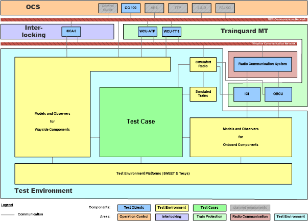

## 为什么需要“云计算”
- 如今越来越多的应用都在进行“云化”，特别是互联网公司最为积极。那么到底什么是云，问什么会需要云呢？
- 传统的应用正在变得越来越复杂：需要支持更多的用户，需要更强的计算能力，需要更加稳定安全等等，而为了支撑这些不断增长的需求，企业不得不去购买各类硬件设备（服务器，存储，带宽等等）和软件（数据库，中间件等等），另外还需要组建一个完整的运维团队来支持这些设备或软件的正常运作，这些维护工作就包括安装、配置、测试、运行、升级以及保证系统的安全等。便会发现支持这些应用的开销变得非常巨大，而且它们的费用会随着你应用的数量或规模的增加而不断提高。这也是为什么即使是在那些拥有很出色IT部门的大企业中，那些用户仍在不断抱怨他们所使用的系统难以满足他们的需求。而对于那些中小规模的企业，甚至个人创业者来说，创造软件产品的运维成本就更加难以承受了。
- 针对上述问题解决方案便是“云计算”！将应用部署到云端后，可以不必再关注那些令人头疼的硬件和软件问题，它们会由云服务提供商的专业团队去解决。使用的是共享的硬件，这意味着像使用一个工具一样去利用云服务（就像插上插座，你就能使用电一样简单）。只需要按照你的需要来支付相应的费用，而关于软件的更新，资源的按需扩展都能自动完成。
- 就像家里用水，当需要的时候，扭开水龙头，水就来了，我只需要操心交水费就是了！我不需要自己挖井、净化这些，也不需要用到早些年农村用的压水井。

## 云计算基本原理
- 摘自百度百科上面的描述：
    - 云计算（cloud computing）是分布式计算的一种，指的是通过网络“云”将巨大的数据计算处理程序分解成无数个小程序，然后，通过多部服务器组成的系统进行处理和分析这些小程序得到结果并返回给用户。云计算早期，简单地说，就是简单的分布式计算，解决任务分发，并进行计算结果的合并。因而，云计算又称为网格计算。通过这项技术，可以在很短的时间内（几秒钟）完成对数以万计的数据的处理，从而达到强大的网络服务。
    - 现阶段所说的云服务已经不单单是一种分布式计算，而是分布式计算、效用计算、负载均衡、并行计算、网络存储、热备份冗杂和虚拟化等计算机技术混合演进并跃升的结果。
- 简单的说云计算就是计算服务的提供（包括服务器、存储、数据库、网络、软件、分析和智能）- 通过Internet（云）提供快速创新、弹性资源和规模经济。对于云服务，通常用户只需要使用多少支付多少，从而帮助降低运营成本，使基础设施更有效地运行，并根据业务需要的变化对服务的使用。
- 所以云计算就具备费用低、性能、效率、可靠性等方面的有点。
- `对于铁路信号系统行业，云计算的费用低(可云化部分使用通用服务器代替专用设备)、高性能、高可靠性有显著优势，可以轻松实现7x24，甚至365x24可靠运行。`

## 云计算的类型：
- 公有云：公有云为第三方云厂商所拥有和运营，他们通过 Internet 提供其计算资源。
- 私有云：私有云是指专供一个企业或组织使用的云计算资源。私有云可以实际位于公司的现场数据中心之上。
- 混合云：混合云组合了公有云和私有云，通过允许在这二者之间共享数据和应用程序的技术将它们绑定到一起。混合云允许数据和应用程序在私有云和公共云之间移动，使你能够更灵活地处理业务并提供更多部署选项，有助于你优化现有基础结构、安全性和符合性。
- 网上很流行的一种比喻：男人找个女友或老婆是自建私有云，单身约炮或者到娱乐场所消费是公有云服务，按需使用并可弹性扩容，已婚男人找二奶小蜜则属于混合云。

## 云服务类型
- 大多数云计算服务都可归为：基础架构即服务（Infrastructure as a service, IaaS） 平台即服务（Platform as a Service, PaaS） 软件即服务(Software as a Service, SaaS)。当然还有很多其他的概念：无服务器计算 (Serverless)、Contrainer as a Service(CaaS)、Blockchain as a Service(BaaS)、Function as a Service(FaaS)。这里只考虑常见的三种服务类型IaaS PaaS SaaS。
- 下图主要总结了三种模型的主要差别：

- SaaS: 软件即服务（也称为云应用程序服务）代表了云市场中企业最常用的选项。 SaaS利用互联网向其用户提供应用程序，这些应用程序由第三方供应商管理。 大多数SaaS应用程序直接通过Web浏览器运行，不需要在客户端进行任何下载或安装。
    - SaaS通过大大减少安装，管理和升级软件等繁琐任务所花费的时间和金钱，为员工和公司提供了许多好处。 这让技术人员可以花更多时间来处理组织内更紧迫的事情和问题。
    - 特点：
        - 在统一的地方管理
        - 托管在远程服务器上
        - 可通过互联网访问
        - 用户不负责硬件或软件更新
    - 典型的是office 365
- PaaS: 云平台服务或平台即服务（PaaS）为某些软件提供云组件，这些组件主要用于应用程序。 PaaS为开发人员提供了一个框架，使他们可以基于它创建自定义应用程序。所有服务器，存储和网络都可以由企业或第三方提供商进行管理，而开发人员可以负责应用程序的管理
    - 通过互联网提供软件，PaaS提供了一个软件创建平台。该平台通过Web提供，使开发人员可以自由地专注于创建软件，同时不必担心操作系统、软件更新，存储或基础架构。
    - 云计算平台提供硬件, OS, 编程语言,开发库,部署工具（各种培训班、方案策划、软硬件等）,帮助软件开发者更快的开发软件服务，某些时候也叫做中间件。
    - 开发人员重点关注自己软件的代发、以及软件运行所需的依赖（这些依赖云计算平台提供）。
- IaaS：IaaS通过虚拟化技术为组织提供云计算基础架构，包括服务器、网络，操作系统和存储等。这些云服务器通常通过仪表盘或API提供给客户端，IaaS客户端可以完全控制整个基础架构。 IaaS提供与传统数据中心相同的技术和功能，而无需对其进行物理上的维护或管理。 IaaS客户端仍然可以直接访问其服务器和存储，但它们都通过云中的“虚拟数据中心”。
    - IaaS客户端负责管理应用程序、运行时、操作系统，中间件和数据等方面。但是，IaaS的提供商管理服务器、硬盘驱动器、网络，虚拟化和存储。一些提供商甚至在虚拟化层之外提供更多服务，例如数据库或消息队列。
    - 说白了，IaaS就是把所有的硬件、OS、网络、存储等资源进行统一管理，提供给客户使用。客户根据自己的需求进行申请。应用还跟之前的一样去部署，只是不需要要去关心服务器、存储、网络、系统这些资源的部署。

## 基于不同云服务类型系统测试模型
- 我们先来看一下 TGMT 系统测试环境 Metro Galaxy 的架构图: 
    - 我们的被测试对象是TGMT系统，主要包含: WCU-ATP WCU-TTS OBCU ICI
- 系统主要硬件组成部分有： 